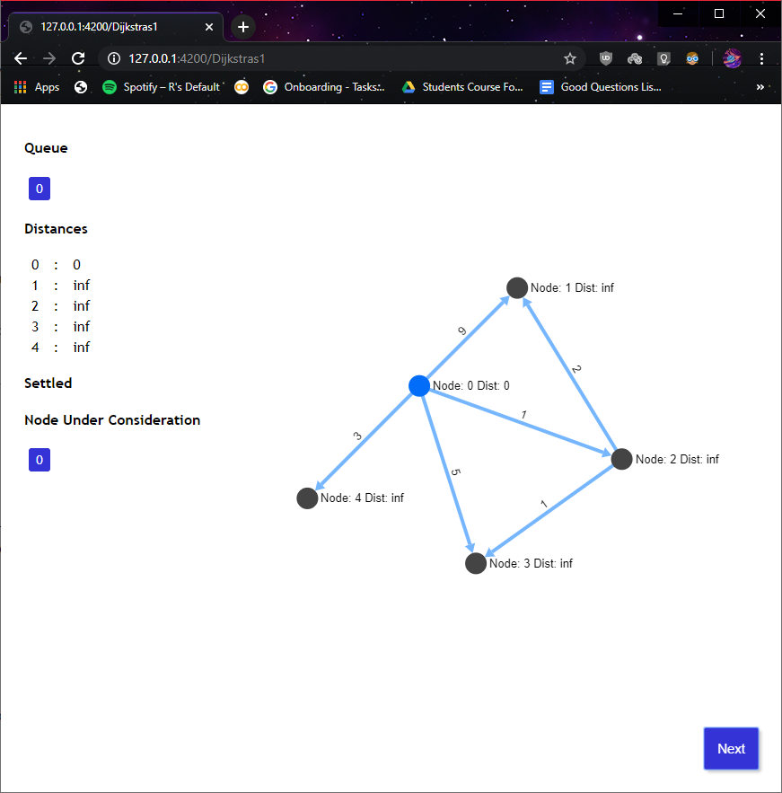
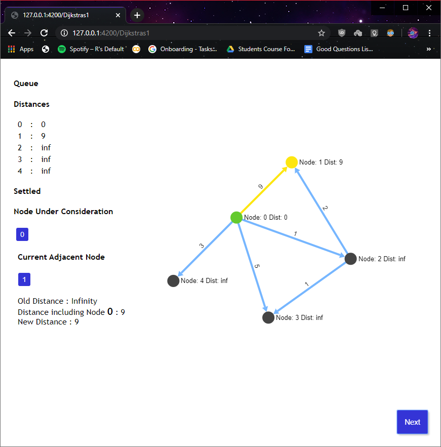
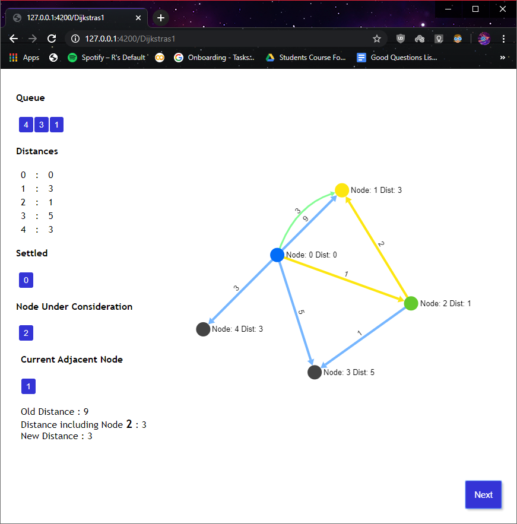
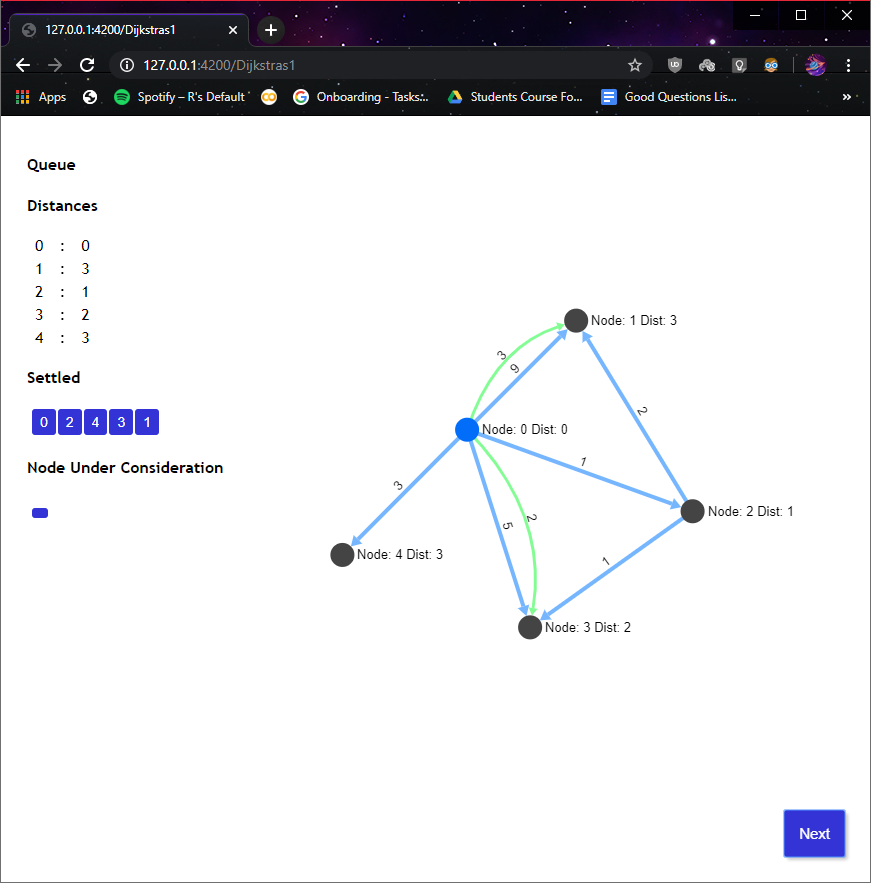

# Visualization of Dijkstra's algorithm
4th Semester Design and Analysis of Algorithms Project
 

Dijkstra's algorithm is used to find the shortest path from a single source vertex to all other vertices in a given graph.
 
 
This is a teaching tool that is used for easy visualization of Dijkstra's algorithm implemented using the Sigma JS library for graph drawing. 
  
Run 
<code> python server.py </code> to start the applicaton. /Dijkstras1 is the flask endpoint for visualization of example 1 (in.in), /Dijkstras2 is the endpoint for visualization of example 2 (in1.in).

<h4> Input format </h4>
First line contains N - number of nodes, E - number of edges:  

*N E*  
The following E lines contain 3 integers describing each edge of the graph:  
*EdgeSource EdgeDestination EdgeWeight*  
The last line contains a source and destination for which the shortest path needs to be returned : 
*Src Dest*  

 
<b>Example</b>  
5 6  
0 1 9  
0 2 1  
0 3 5  
0 4 3  
2 1 2  
2 3 1  
0 3  

<h2> Screenshots </h2>
The node under consideration is colored blue.

The current adjacent node is colored yellow.

If a shorter path is found between two nodes it is showed with a green curved edge. 

